# 🚀 DevOps Project: Automated Repository Mirroring System (GitLab → GitHub)
## Project Overview
This project demonstrates how to automate repository synchronization from GitLab to GitHub using push mirroring. The GitLab repository acts as the primary source, and all code changes are automatically mirrored to GitHub.
This ensures:
- Continuous backup of source code
- High availability across platforms
- Improved disaster recovery readiness
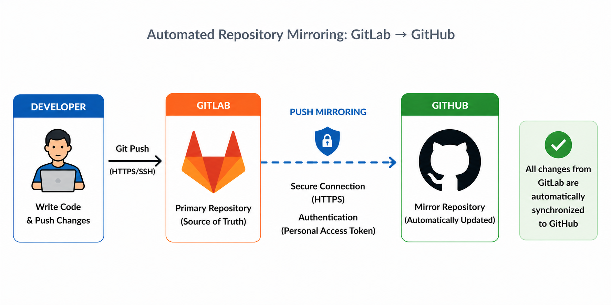
---
## Prerequisites
- Before starting, ensure you have:
- Active GitLab account
- Active GitHub account
- Repository access (Maintainer/Owner in GitLab)
- Git installed on your system

Check Git installation:
```bash
git --version
```
---
## Implementation Steps
### Step 1: Create Repository in GitLab
- Create a new project (blank repository)
- This will act as the primary repository
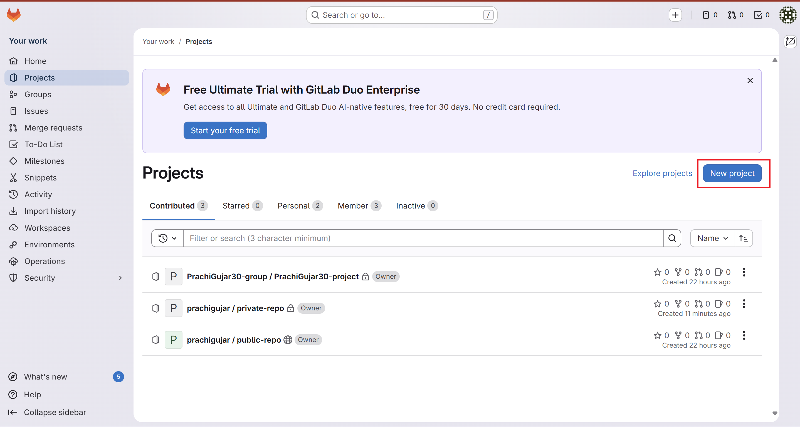
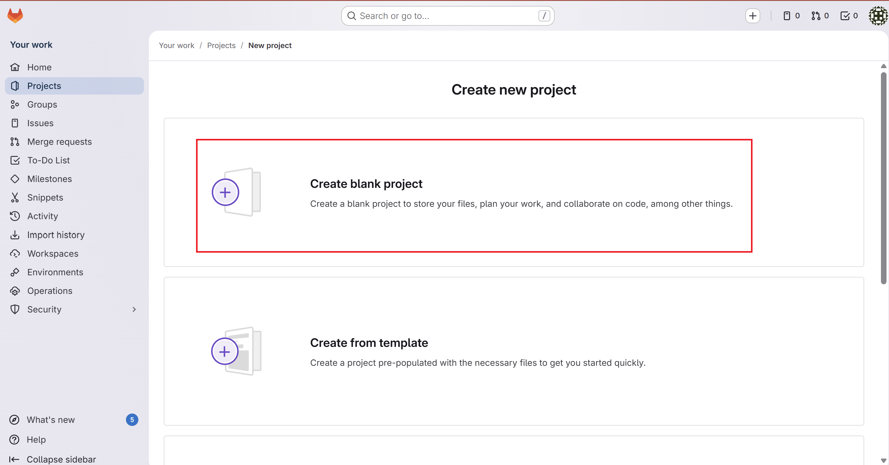
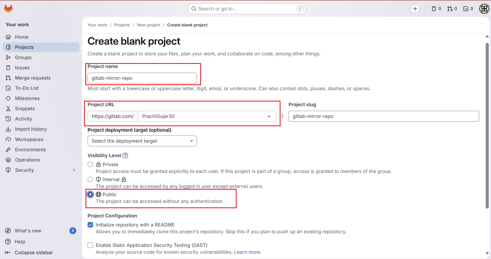
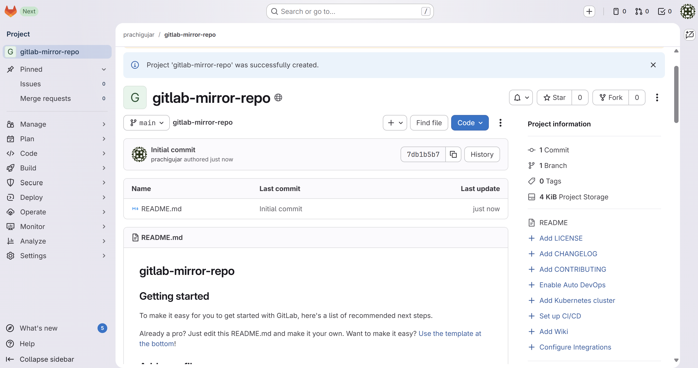

### Step 2: Create Repository in GitHub
- Create a new empty repository
- This will act as the mirror repository
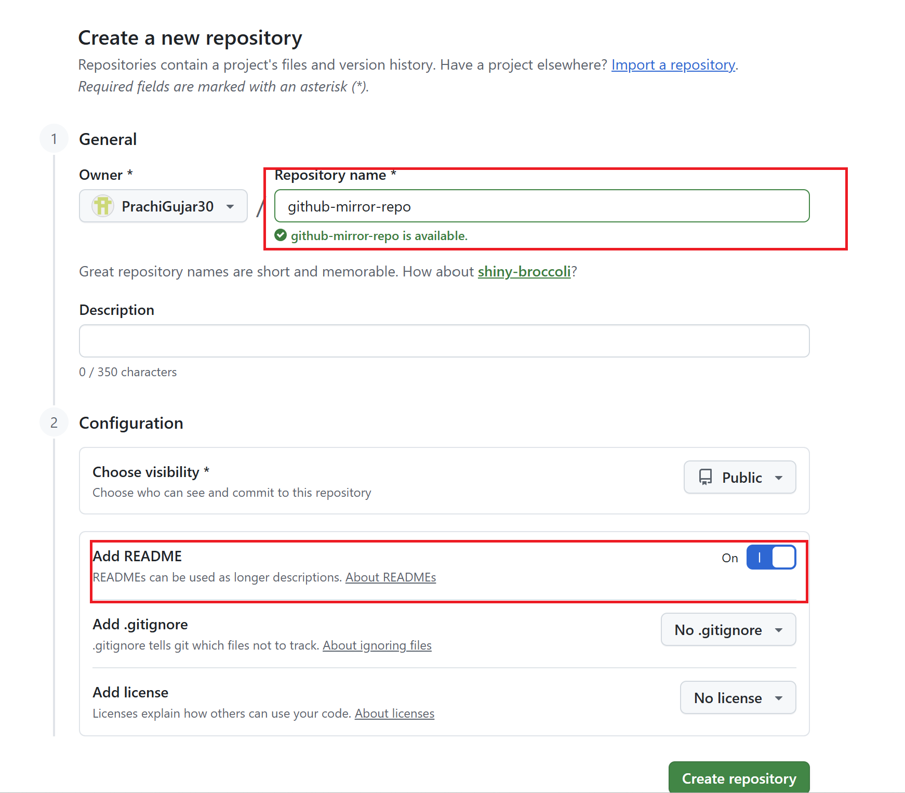
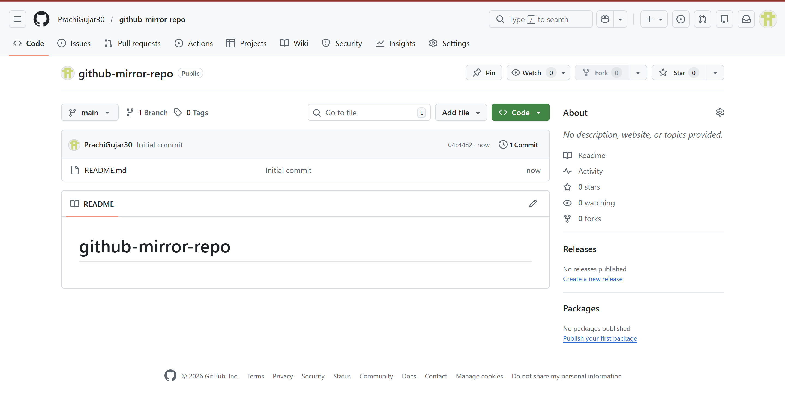

### Step 3: Configure Push Mirroring in GitLab
1. Go to Settings → Repository
- Scroll to Mirroring repositories
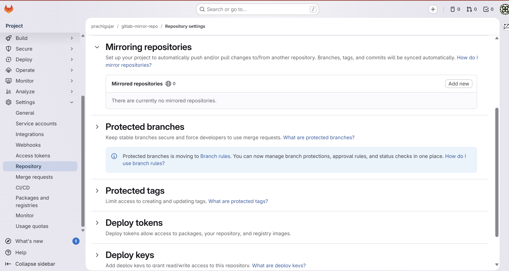
2. Copy https github URL and Paste in Gitlab 
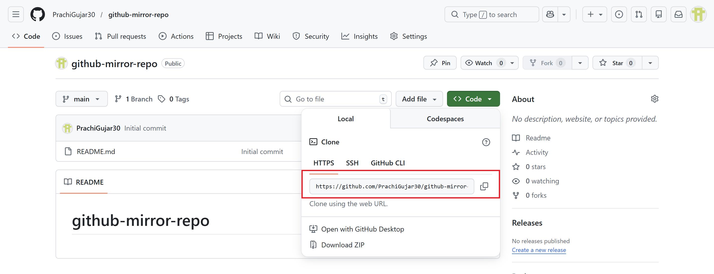
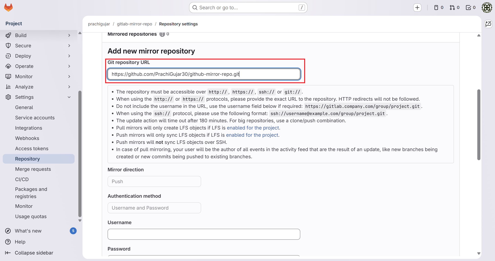
3. Go to Github and Generate Token for password 
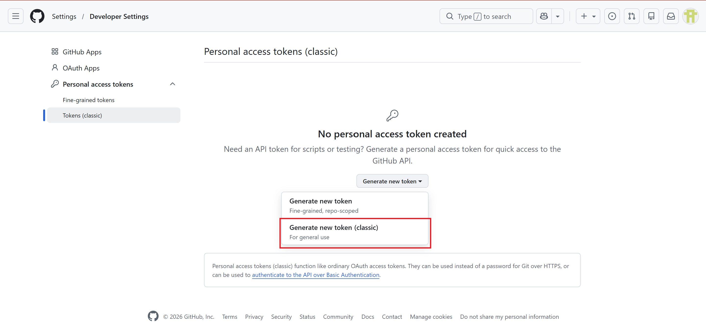
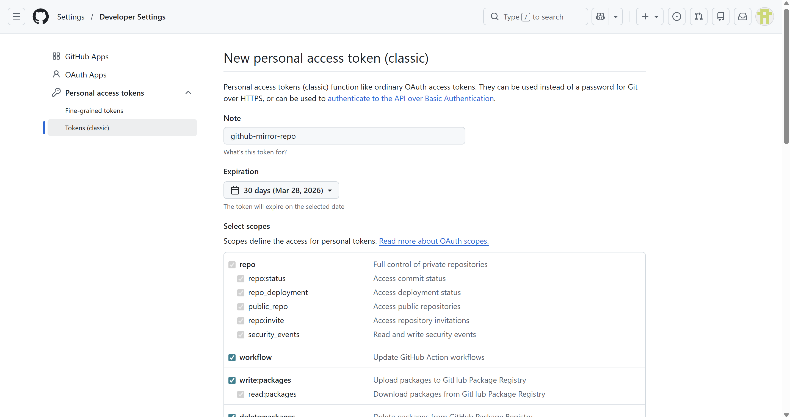
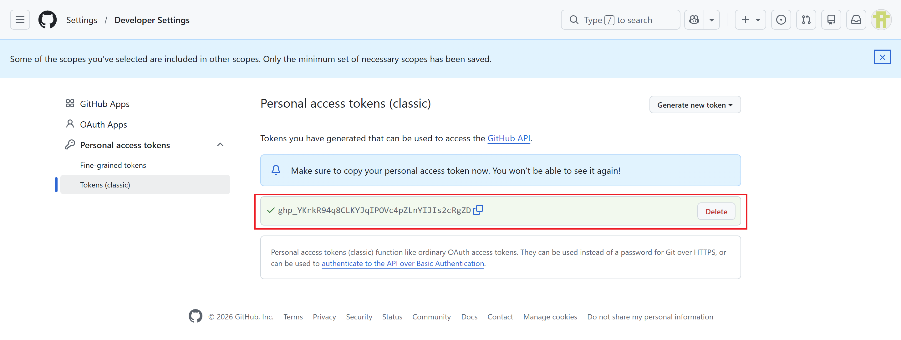
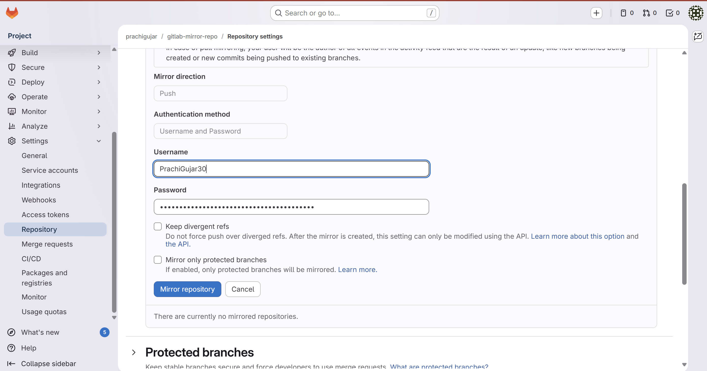
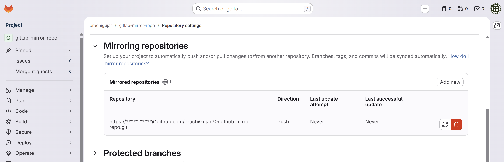
### Step 4: Clone GitLab Repository
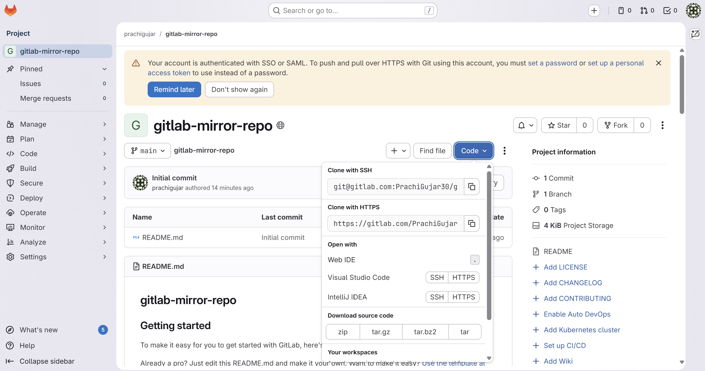
``` bash
git clone <gitlab-repo-url> 
```
``` bash
cd <repo-name>
```
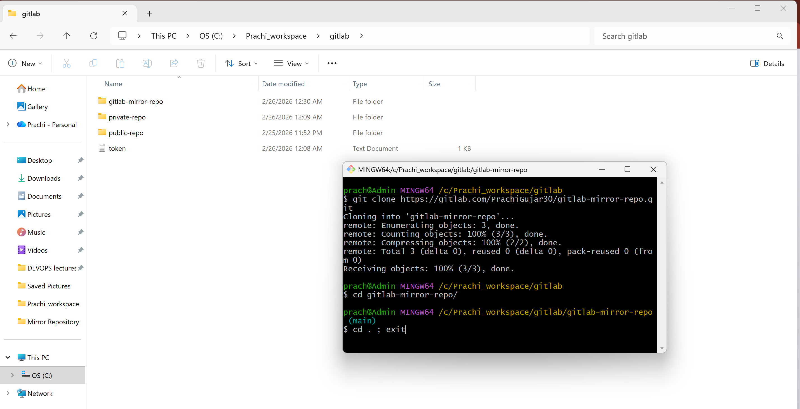
### Step 5: Add Code and Push
1. Create a sample file
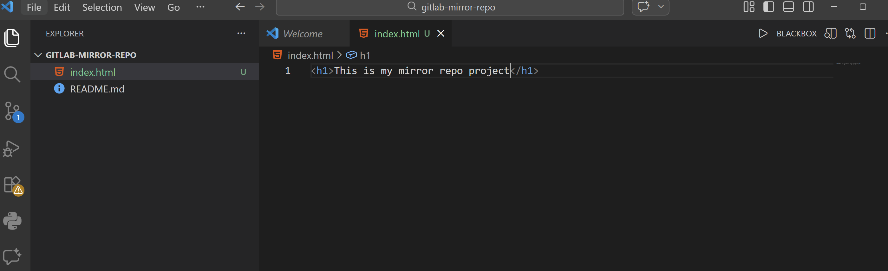
2. Push the file using Source Control
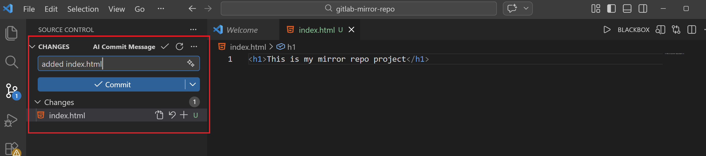
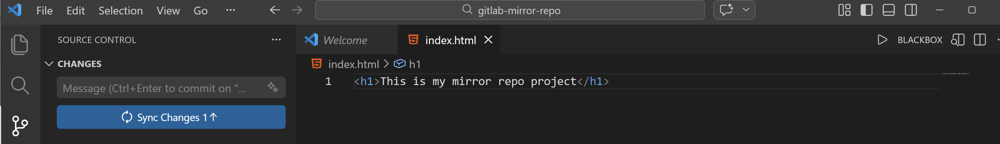
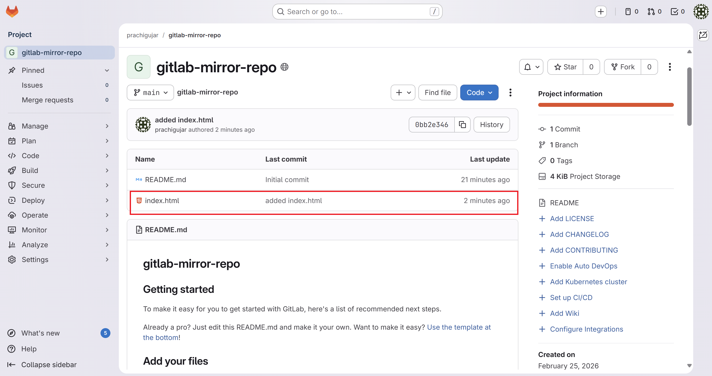
### Step 6: Verify Mirroring
- Check GitHub repository
- All changes from GitLab should automatically reflect
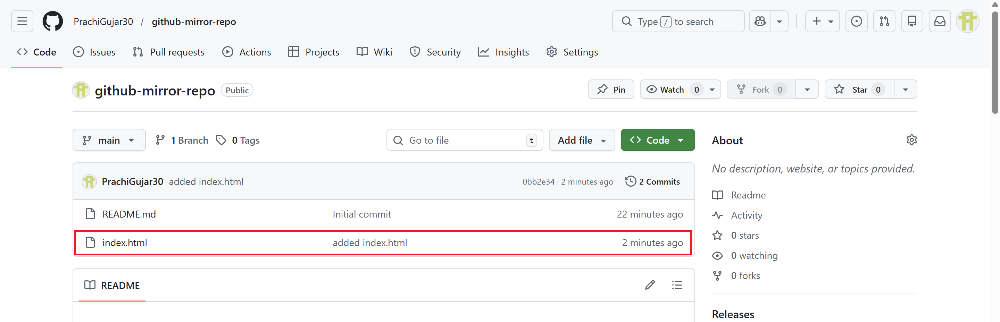
## Summary
This project implements an automated repository mirroring system between GitLab and GitHub, where changes from GitLab are automatically synchronized to GitHub using push mirroring. It uses secure token-based authentication to ensure seamless and safe communication while eliminating manual effort. The system enhances code availability, provides backup across platforms, and supports disaster recovery, reflecting key DevOps practices like automation and reliability.